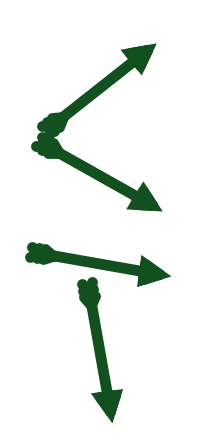
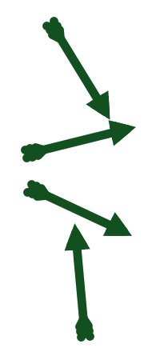
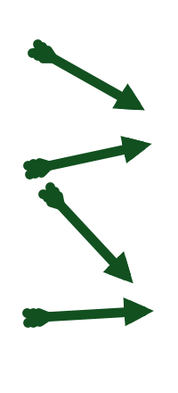
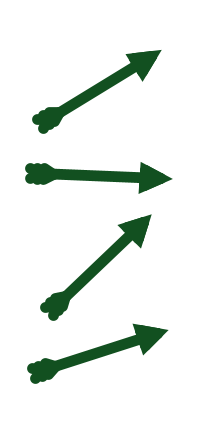
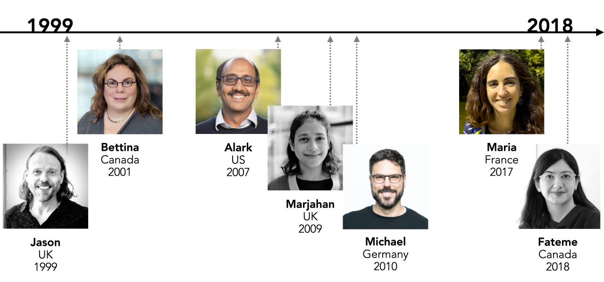
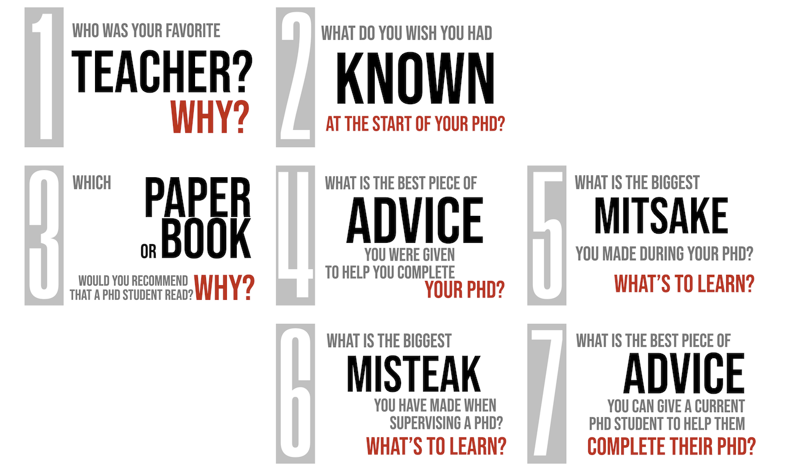
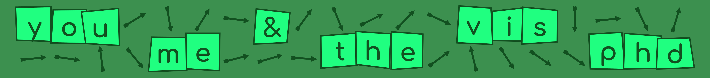

<head>
  <link href="https://fonts.googleapis.com/css2?family=Roboto&display=swap" rel="stylesheet">
</head>

## EuroVIS 2026 - PhD Education Track &raquo; You, Me and the VIS PhD
<!--  &nbsp;&nbsp;&nbsp;&nbsp;&raquo;&nbsp;You, Me and the VIS PhD -->

  
  <blockquote>
<b>A focus on PhD study, skills and supervision for students and staff involved in PhD Education</b> to connect, share best practice and develop ideas for the future ... with an update on a major UK initiative in PhD training.
  </blockquote>

 

Running from **2pm-3:30** and **4pm-5:30** in **F5** on **Tuesday 9th June** - Plan follows 👇.

### Aims

**This focused activity on PhD Education in Data Visualization aims to ...**

  
  <blockquote>

share experiences of and approaches to PhD education in ways that <b>support current PhD students</b>, <b>encourage future PhD students</b> and <b>inspire those supervising PhDs</b> and coordinating PhD programmes to develop networks, approaches and discourse that support this activity.

  </blockquote>

We do so through ...

  
  <blockquote>

A two-session track where we <b>share and develop ideas</b> and experiences about PhD training, <b>discuss  investment</b> in data visualization research training in the UK, and aim to <b>help our PhD students</b> succeed in their studies and our PhD supervisors support them in doing so. 

  </blockquote>

We plan activities that will connect and be useful for all three groups :
1. prospective PhD students
1. current PhD students
1. academics (supervisors - current and future!). 

### Plan

|When?|What?|Lead?|&nbsp;|
|--|-:|--|--|
|| **Session 01** || **Introductions, Updates & Brainstorming**
|**14:00**| **Introductions** | *CT* | graphical introductions in a visual fast-forward |
|**14:30**| **Updates** | *JD* | a focus on the [**DIVERSE-CDT**](https://diverse-cdt.ac.uk/) PhD initiative 14:30ish - Talk 14:45ish - Questions |
|**15:00**| **Brainstorming** &amp; **Connecting** | *CT* | group work to connect, discuss experiences &amp; develop questions and priorities |
|| **Session 02** ||**Panel & Priorities**
|**16:00**| **Panel 7x7** | *JD* |PhD perspectives and provocations in a 7x7 shootout! |
|**16:49** 🤔| **Open Discussion** | *JD* | Questions & discussion around PhD perspectives |
|**17:15**| **Priorities** | *CT* | collective work to identify PhD initiatives |

<h3>Session 01 - Introductions, Updates &amp; Brainstorming</h3> 

<h5>coordinated by <em>Cagatay Turkay</em></h5>

  
  <blockquote>

Meet the community and <b>discuss and develop priorities</b> for discourse around PhD education as well as hearing about <a href="https://diverse-cdt.ac.uk/">DIVERSE-CDT</a>
  
  </blockquote>

An activity in which PhD students introduce themselves, the EPSRC Doctoral Training Centre for Diversity in Data Visualization reports on progress and plans, and we collectively contribute, prioritise and answer questions about planning, doing, supporting and supervising PhDs.

<ol>
<li><b>Introductions</b> - current and prospective PhD students say hello (graphically)</li>
<li><b>Updates</b> - what's going on at <a href="https://diverse-cdt.ac.uk/">DIVERSE-CDT</a></li>
<li><b>Brainstorming</b> - group work to connect, discuss and develop questions and priorities for the panel</li>
</ol>

#### 1.1 Introductions from PhD students 

We invite current or prospective PhD students, at any stage in their studies or planning, to introduce themselves. 

The submission is a single visual that tells us something about you and your PhD. This can be anything, submitted in advance, but might involve:

- your approach to visualization / design
- something important to your PhD
- why you love visualization
- your favourite / least favourite data vis
- something about you (or your data, or your cat)
- the future of visualization
- something you care about

You can request a 1, 3 or 5 minute presentation during the submission and we do our best to fit that in during the day!

<del>Deadline **01 May 2026 (Anywhere on Earth)**</del>

New Deadline **31 May 2026 (Anywhere on Earth)**

Submit your visual (PDF) and details [through this Google Form](https://docs.google.com/forms/d/e/1FAIpQLSfRlecXFRfDxf9SgmfccJmDEGJYRcz6c02BsAQ_LuViZ-KNTQ/viewform?usp=sharing&ouid=103543335356597978812).

#### 1.2 Updates

Find out about [**DIVERSE-CDT**](https://diverse-cdt.ac.uk/) the UK's new _Doctoral Training Centre for Diversity in Data Visualization_, hosted at the _University of Warwick_ and _City St George's, University of London_.

This innovative PhD program in _Data Visualization_ is delivering research training for 60 PhD students in the UK over the next decade. 

Come and hear the latest, and ask questions about, and get involved in this significant initiative in PhD education.

#### 1.3 Brainstorming

Working in small groups those undertaking, and having completed PhDs, participate in loosely structured discussion to :

 1. get to know each other
 2. discuss PhD experiences
 3. develop questions and priorities for _The Panel_

<!---
Prompts will be provided, for example ...

 * how can we improve PhD education in Data Visualization?
 * what have you always wanted to know about PhD students / supervisors?
--->

<h3>Session 02 - The Panel - Diversity &amp; Priority</h3> 

<h5>coordinated by <em>Jason Dykes</em></h5>

  
  <blockquote>

A diverse panel, in which PhD <b>experiences are introduced and discussed</b> and priorities for supporting, enhancing and extending PhD education are identified.

  </blockquote>

Hear from and connect with a diverse panel of guest participants who have acquired PhDs. Learn from their experiences of study and supervision and grill them with questions as we discuss and identify priorities for improving and widening PhD study.

<ol>
<li><b>Panel Discussion</b></li>
<li><b>Open Discussion</b></li>
</ol>

### 2.1 Panel Discussion

A lively _panel discussion_ in which experiences of supervision are introduced and discussed, and open questions are addressed in a structured session with the old hands that will include plenty of audience participation!

The panel is packed with excellent communicators, with complimentary experience, who are diverse in terms of academic discipline, perspective and geography.

|&nbsp;|&nbsp;|&nbsp;|&nbsp;|&nbsp;|
|--:|:--:|--:|:-:|:--|
|[**Fateme Rajabiyazdi**](./who/panelFR.png)|2018|_University of Calgary_|**&raquo;**|University of Calgary|
|[**Maria Jesus Lobo Gunther**](./who/panelML.png)|2017|_Université Paris Saclay_|**&raquo;**|Université Gustave Eiffel & IGN|
|[**Michael Sedlmair**](./who/panelMS.png)|2010|_University of Munich (with BMW)_|**&raquo;**|University of Stuttgart|
|[**Marjahan Begum**](./who/panelMB.png)|2009|_University of Nottingham_|**&raquo;**|University of Nottingham & City St George's|
|[**Alark Joshi**](./who/panelAJ.png)|2007|_University of Maryland Baltimore County_|**&raquo;**|University of San Fransisco|
|[**Bettina Speckmann**](./who/panelBS.png)|2001|_University of British Columbia_|**&raquo;**|TU Eindhoven|
|_and perhaps ..._|
|[**Jason Dykes**](./who/panelJD.png)|1999|_University of Leicester_|**&raquo;**|City St George’s, University of London|

We will be kicking off by asking each participant to answer a set of 7 questions in 7 minutes - a _7x7 Shootout!_.

Here they are ...

... and then it will be down to participants to seek further guidance, challenge viewpoints and engage in informative and inspiring academic debate. 
🙂

### 2.2 Open Discussion

Questions from the brainstorming exercise and discussion around these.

### 2.3 Priorities & Initiatives

We seek to uncover and prioritise activities and initiatives that can improve and extend PhD education for all parties with _The Panel_.

**Our hope is that people to leave the room …**

  
  <blockquote>

 * knowing somebody new - **more connected**
 * knowing that there is _something they can do_ to improve PhD Education (for themselves or more widely) - **more informed**
 * perhaps committing to an action: _applying a solution_ to improve PhD Education  - **inspired & committed**

  </blockquote>

<h2>Resources</h2>

#### Recommended Books &amp; Papers

We have an open [Zotero Library](https://www.zotero.org/groups/6579261/eurovis_-_you_me__the_vis_phd/library) that we aim to fill with links to recommended books and papers.

#### Panel Questions

Ask, check and upvote question for the panel on this [Poll Everywhere](https://pollev.com/jsndyks).
<!-- https://miro.com/app/board/o9J_kpGBG0g=/ -->

#### WhiteBoard

We will be logging and developing ideas on a [Miro Board]().
<!-- https://miro.com/app/board/o9J_kpGBG0g=/ -->

#### DIVERSE-CDT

Jason mentioned a couple of links and flashed up a few QR codes during his talk - you can find them all here:

<!---
|When?|What?|Lead?|&nbsp;|
|-:|--|--|--|
| [**DIVERSE-CDT Doctoral Researchers**](https://diverse-cdt.ac.uk/doctoral-researchers/) | Information about the 2025 PhD students - do try to find them in Nottingham. |
|[**What is a Research Lens?**](https://observablehq.com/@cdt2025/what-is-a-research-lens)| Lens thinking from the DIVERSE-CDT delivery team|
|[**DIVERSE-CDT Leadership**](https://diverse-cdt.ac.uk/leadership/)| Who's who on the leadership team|
|[**PTRSA Paper**](https://royalsocietypublishing.org/rsta/article/380/2233/20210299/112267/Visualization-for-epidemiological-modelling)| The co-authored paper in the _Philosophical Transactions of the Royal Society_ in which we used deep (live) links to Observable notebooks to synthesize and deliver evidence from parallel projects|

--->

<table>
<thead>
<tr>
<th style="text-align:right">When?</th>
<th>What?</th>
<th>Lead?</th>
<th>&#xA0;</th>
</tr>
</thead>
<tbody>
<tr>
<td style="text-align:right" valign="top" nowrap><a href="https://diverse-cdt.ac.uk/doctoral-researchers/"><strong>DIVERSE-CDT&nbsp;&nbsp; &nbsp;&nbsp;Doctoral Researchers</strong></a></td>
<td valign="top">Information about the 2025 PhD students - do try to find them in Nottingham.</td>
<td></td>
<td></td>
</tr>
<tr>
<td style="text-align:right" valign="top" nowrap><a href="https://observablehq.com/@cdt2025/what-is-a-research-lens"><strong>What is a Research Lens?</strong></a></td>
<td valign="top">Lens thinking from the DIVERSE-CDT delivery team</td>
<td></td>
<td></td>
</tr>
<tr>
<td style="text-align:right" valign="top" nowrap><a href="https://diverse-cdt.ac.uk/leadership/"><strong>DIVERSE-CDT&nbsp;&nbsp; &nbsp;&nbsp;Leadership</strong></a></td>
<td valign="top">Who&apos;s who on the leadership team</td>
<td></td>
<td></td>
</tr>
<tr>
<td style="text-align:right" valign="top" nowrap><a href="https://royalsocietypublishing.org/rsta/article/380/2233/20210299/112267/Visualization-for-epidemiological-modelling"><strong>PTRSA Paper</strong></a></td>
<td valign="top">The co-authored paper in the <em>Philosophical Transactions of the Royal Society</em> in which we used deep (live) links to Observable notebooks to synthesize and deliver evidence from parallel projects</td>
<td></td>
<td></td>
</tr>
<tr>
<td style="text-align:right" valign="top" nowrap><a href="https://jsndyks.github.io/diverse-cdt/researchScientist/"><strong>Research Scientist</strong></a></td>
<td valign="top"><b>We are recruiting!</b> This link tells you more about the kind of person we are looking for and has further links to the job advert and application details</td>
<td></td>
<td></td>
</tr>
</tbody>
</table>

<!---

---

#### The Centre

* a short introduction to [**DIVERSE-CDT**](https://diverse-cdt.ac.uk/) the UK's innovative _Doctoral Training Centre for Diversity in Data Visualization_, hosted at the _University of Warwick_ and _City St George's, University of London_.

 - **the NoteBook PhD**  _Jo Wood_ presents the programme and rationale, and innovations in the use of technology for PhD study;
 - **the Component PhD**  _Cagatay Turkay_ outlines plans for partner engagement and PhD focus;
- **the Cohort PhD** _Steph Wilson_ shares initiatives and learnings around diverse recruitment, support for students and cohort study;
 - **PhD Discussion**  _Jason Dykes_ and _Cagatay Turkay_ participate in a semi-open, semi-structured discussion facilitated by host _Bob Laramee_; 

#### The Thinking

A _call to action_ and brainstorming exercise in which we work collectively to develop, prioritise and answer the questions identified throughout the day.

Examples may include :

 1. **_what are the skills required by a PhD student at the end of year 1 of their studies?_** 
   _and do these differ by DataVis PhD 'type' and academic tradition / geography?_ 
   _and how do we support them?_ 
   _how can the EuroVIS community work together to support European VIS PhD students?_
  
 - **_what makes a good PhD internship?_** 
   _what can we learn from existing approaches, experiences?_ 
   _how can we support students, and intern providers during PhD internships?_ 
   _how can we encourage more organizations to provide meaningful internships through which visualization research can be conducted?_
   
 - **_how can we give PhD students opportunities to publish and learn about the publications process by participating in it?_**

But please bring and develop your questions of your own for collective action.

--->

<b>Jason Dykes</b> 
<b>Cagatay Turkay</b> 
<i>08/06/26</i>
<!-- <i>07/06/26</i> -->
<!-- <i>03/05/26</i> -->
<!-- <i>01/05/26</i> -->
<!-- _31/03/26_ -->

<!--
YOU ME & THE VIS PHD
  -->
